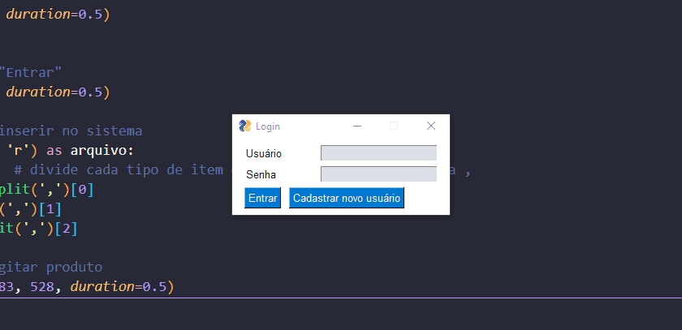

<!-- Status -->

<!-- <h4 align="center"> 
---
	🚧  Projeto automacao-cadastro-produtos 🚀 Em construção...  🚧
</h4> 

<hr> -->

<div align="center" id="top">
  
</h1>

  &#xa0;

 </div>
 
 <h1 align="center">Automação para cadastro de produtos</h1>

<p align="center">
  <a href="#dart-sobre">Sobre</a> &#xa0; | &#xa0; 
  <a href="#sparkles-funcionalidades">Funcionalidades</a> &#xa0; | &#xa0; 
  <a href="#rocket-tecnologias">Tecnologias</a> &#xa0; | &#xa0; 
  <a href="#white_check_mark-pré-requisitos">Pré-requisitos</a> &#xa0; | &#xa0;
  <a href="#checkered_flag-começando">Começando</a> &#xa0; 
<!--  <a href="#autor">Autor</a> -->
</p>


<br>
				
	
## :dart: Sobre ##

```sh
• Automação para cadastrar produto com sua quantidade e preço para o um sistema desktop
```

## :sparkles: Funcionalidades ##


:heavy_check_mark: Lê dados .txt com o produto, quantidade e preço ;\
:heavy_check_mark: Extrai produtos e seri no sistema através de uma iteração no arquivo txt.


## :rocket: Tecnologias ##
 
 
As seguintes ferramentas 🛠 foram utilizadas na construção do projeto:


<table>
  <thead>
    <th>Back-end</th>
  </thead>
  <tbody>
    <tr>
      <td>Python</td>
    </tr>
    </tr> 
	    
  </tbody>

</table>


## :white_check_mark: Pré-requisitos ##


Antes de começar 🏁, você vai precisar ter instalado em sua máquina as sequintes ferramentas:
[Git](https://git-scm.com/downloads) e [Python](https://www.python.org/downloads/).
Além disto é bom ter um editor para trabalhar com o código, tal como: [VS Code](https://code.visualstudio.com/download)


## :checkered_flag: Começando ##


```bash
# Clone este repositorio
 -> git bash here
  $ https://github.com/LucasFeliciano02/automacao-cadastro-produtos.git

# Acesse a pasta do projeto que aparecerá em sua área de trabalho
 -> mouse esquerdo -> Abrir com Code

# Colocar os seguintes comandos no terminal para ativar o Interpretador do python a fim de rodar o arquivo
 1º  ->  py -m venv venv
 2º  ->  venv\Scripts\activate.bat  
 3º  ->  .\venv\Scripts\activate.bat  

# Roda código:
 -> terminal -> pip install pyautogui pillow mouseinfo
 -> terminal -> mouseInfo()  # Para saber posição do mouse, clicar f6 para salvar codernada
```

---

<br>

<!---### Autor --->


Accomplished with :heart: by [LucasFeliciano02](https://github.com/LucasFeliciano02) 👋


[](https://www.linkedin.com/in/lucas-henrique-marques-feliciano-aa5aab222/) 


&#xa0;


<a href="#top">Voltar para o topo</a>
